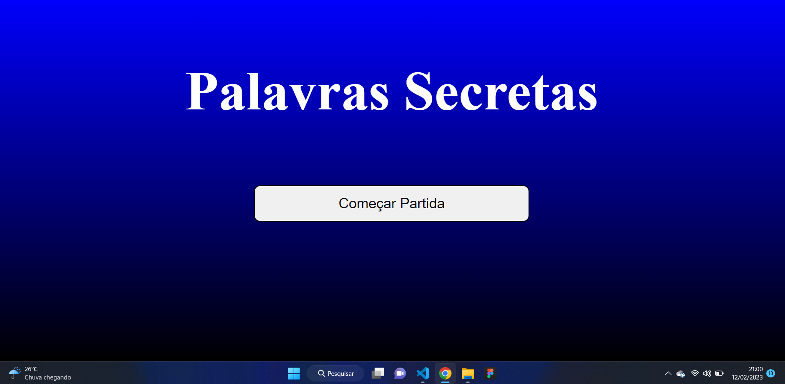

# Projeto React API Pokemons



Aplicação que reproduz um joguinho de acertar palavras

## Indice
- <a href="#Tecnológias-utilizadas"> Tecnológias utilizadas</a>
- <a href="#layout ">Layout </a>
- <a href="#demostração ">Demostração </a>
- <a href="#comorodaresseprojeto ">Como rodar esse projeto?</a>
- <a href="#tecnologiasutilizadas ">Tecnologias utilizadas</a>
- <a href="#pessoasautoras">Pessoas autoras</a>
- <a href="#proximospassos ">Proximos passos</a>

## 📱Fucionalidades do projeto

- O site tem 3 páginas: Começar partida, Jogo;
- **Página Começar Partida:**
	- [X]  Mostra titulo do jogo;
	- [X]  Mostra botão de começar jogo;
- **Página Jogo**
	- [X] Monstrar pontuação;
	- [X] Monstrar quantidade de chances que o jogador tem.
	- [X] Sortear letra e tema aletatorio.


    ## 👀Layout


## Demonstração

[Link demonstração](https://loja-virtual-zqvn-git-master-mathmendesreis.vercel.app/)

## Como rodar esse projeto?

```
# clone este repositorio
$ git clone https://github.com/MathMendesReis/projeto-react-apis.git

# Acesse a pasta do projeto no seu terminal
$ cd secrete-wordls/

#instale as depedências
<!-- $ npm install -->

# Execute a aplicação
<!-- $ npm run start -->

# A aplicação sera iniciada na porta 300, 
acesse pelo navegador: http:http://localhost:3000
```

## Tecnologias utilizadas

1. [React js](https://reactjs.org/)
2. [Styled-components](https://styled-components.com/)
3. [React Hooks](https://reactjs.org/docs/hooks-intro.html)

## Pessoas autoras


[Linkedin](https://www.linkedin.com/feed/?trk=seo-authwall-base_signin-form_submit)

## Proximos passos

-[ ] Torna o site responsivo.

-[ ] Criar pagina de fim de jogo.

-[ x] Resolver bugs.
